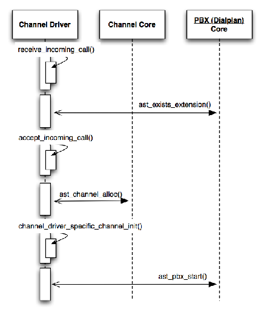

#Asterisk

Russell Bryant

Asterisk<sup>1</sup>是一个开源的电话通讯应用软件平台，使用GPLv2授权协议发布。简而言之，Asterisk就是一个打电话、接电话和对电话进行定制处理的服务器端应用程序。

这个项目是由Mark Spencer在1999年启动的。Mark曾经有一个公司叫做Linux支持服务公司（Linux Support Services），他需要一个电话系统帮他运营业务。他没太多的钱去买一个系统，所以就自己做了一个。随着Asterisk逐渐流行起来，Linux支持服务公司就把业务转向了Asterisk，并且把公司的名称改为Digium公司（Digium, Inc）。

Asterisk这个名称来自Unix通配符，*。Asterisk项目的目标是能完成所有的电话通讯事务。通过追求这个目标，Asterisk现在可以支持相当多的接打电话的技术。这里面包括多种VoIP（Voice Over IP：网络电话技术）协议，也包括和传统电话网络的模拟和数字连接，或者和PSTN（Public Switched Telephone Network：公用电话交换网）的连接。Asterisk的强项就是系统能够接听和拨打多种类型的电话。

一旦使用Asterisk系统接听或拨打了电话，那么就有很多额外的特性能处理这些电话。有些特性更通用一些，例如语音信箱，这些特性会预制在系统里。也有一些其他小的特性可以组合在一起创建定制化的语音应用，例如回放声音文件、读出数字或语音识别等。

##1.1. 关键的架构概念

本小节讨论一些架构上的概念，这些概念对于Asterisk的所有部分都很关键，它们是Asterisk架构的基础。

###1.1.1. 通道（Channels）

Asterisk中的通道表示Asterisk系统和某个电话通讯节点（telephony endpoint）的连接（如图1.1所示）。最常见的例子是当一部电话接入Asterisk系统时。这个连接是由一个单独的通道表示。在Asterisk代码里，通道就是ast_channel数据结构的一个实例。举例来说，当前的呼叫场景可能是一个人正在和语音信箱交互。

<div align="center"></div>
<div align="center">图1.1 由一个单通道表示的单个电话支路</div>

###1.1.2. 通道桥接

可能更熟悉的一种呼叫场景是两个电话之间的连接，就是一个人用电话A呼叫另一个人的电话B。在这种情况下，有两个电话通讯节点连接到Asterisk系统，所以这个呼叫存在两个通道（如图1.2所示）。

<div align="center"></div>
<div align="center">图1.2 由两个通道表示的两个电话支路</div>

像这样连接的Asterisk通道，我们称之为一个通道桥。通道桥接是为了达到传递媒体的目的把通道连接在一起的行为。媒体流通常情况下是音频流。不过，通话过程中也可能有视频流或文字流。即使有多个媒体流（例如既有音频又有视频）存在，在Asterisk系统里都是由呼叫节点的一个单通道处理的。在图1.2中，电话A和电话B有两个通道，中间的桥负责把媒体从电话A传送到电话B，同样，也把媒体从电话B传送到电话A。所有的媒体流都要经过Asterisk进行协商。任何Asterisk不能理解或不能完全控制的东西都是不允许的。这意味着Asterisk可以在不同的技术之间进行录音、音频处理和转换。

如果需要把两个通道桥接在一起，有两种方法可以完成：通用桥接和本地桥接。通用桥接方法就是不管使用的是什么通道技术。它通过Asterisk抽象通道接口传递所有的音频和信令。虽然这是最灵活的桥接方法，但也是最低效的，因为完成这个任务用了过多的抽象层。图1.2就是通用桥的一个例子。

本地桥是使用一种专门的技术把通道连接在一起的方法。如果连接到Asterisk上的两个通道使用的是同样的媒体传输技术，那么可能存在一种方法，可以比通过Asterisk中连接不同技术的多个抽象层的方法更有效一些。例如，如果连接到电话网络的是特殊的硬件，那么可以把通道建立在硬件之上，这样的话媒体就完全不需要流经应用程序。对于VoIP协议来说，节点两端就可以直接互相发送媒体流，最后就只有通话信令继续在服务器上传送了。

选择通用桥接还是本地桥接，是在对两个通道进行桥接的时候决定的。如果两个通道表明支持同一种本地桥接方法，那么就会使用本地桥接。否则，就使用通用桥接方法。为了确定两个通道是否支持同样的本地桥接方法，程序中使用了简单的C函数指针比较。这肯定不是最优雅的方式，但是我们还没有遇到效率上满足不了需求的场景。1.2小节中讨论了提供本地桥接函数的更多细节。图1.3给出了本地桥接的一个例子。

<div align="center"></div>
<div align="center">图1.3 本地桥接的例子</div>

### 1.1.3. 帧

在呼叫过程中，和Asterisk代码通信的过程由帧来完成的，这里的帧就是`ast_frame`数据结构的实例。帧分为媒体帧和信令帧两种。在一个普通的电话呼叫中，含有音频的媒体帧的流会在系统中传递。信令帧则是用来发送呼叫信令事件的消息，例如数字键被按下、通话正处于保持状态或者通话正在被挂断。

可用的帧类型列表是预先定义好的。每个帧都通过数字编码的类型和子类型来标识。完整的类型列表可以在源代码文件`include/asterisk/frame.h`中找到；下面给出一些例子：

 - `VOICE`：这种类型的帧承载了一部分音频流。
 - `VIDEO`：这种类型的帧承载了一部分视频流。
 - `MODEM`：帧里面数据的编码方式，例如T.38的意思是发送网络传真。这种帧类型的主要用途是为了处理传真。帧内的数据可以完全不需要处理，这样信号可以在另一端正确解码，这点非常重要的。它和`AUDIO`不太一样，后者为了节省带宽可以允许降低音频质量。
 - `CONTROL`：这种类型的帧是呼叫信令消息，用来指明通话信令事件的。其中事件包括电话正在被接听、挂断或保持等等。
 - `DTMF_BEGIN`：哪个数字键被按下。当呼叫者在电话上按下一个DTMK键<sup>2</sup>就会发送这种帧。
 - `DTMF_END`：哪个数字键按键完成。当呼叫者停止按DTMK键时就会发送这种帧。

##1.2. Asterisk组件的抽象

Asterisk是一个高度模块化的应用程序。有一个从源代码目录`main/`中编译的核心应用。不过，这个核心应用自己做不了什么。它的主要目的是作为模块注册表。其中也有代码知道怎样把所有的抽象接口连接在一起，从而能让电话打通。这些接口的具体实现，是在运行时通过可加载的模块注册进来的。

默认情况下，在主应用程序启动时，在Asterisk模块目录中预定义的所有模块都会被加载进来。这么做的目的就是为了简单。另外，也可以通过更改配置文件来指明具体加载哪些模块，以什么顺序加载。这样导致配置有点复杂，但是提供了一种能力，即不需要的模块就不用加载了。这种方式最大的好处是降低应用程序的内存占用。当然，也有一些安全上的好处。如果不需要网络通话的话，那就不用加载接受网络连接的模块了。

当模块被加载时，它会在Asterisk核心应用程序中注册所有组件抽象的实现。模块可以实现很多种类型的接口并注册到Asterisk内核。一个模块想注册多少种不同的接口都是允许的。通常来说，功能相关的接口可以放在一个模块里。

1.2.1. 通道驱动程序

Asterisk通道驱动程序接口是最复杂也是最重要的可用接口。Asterisk通道API提供电话通讯协议抽象层，允许所有其他的Asterisk特性可以独立工作，不依赖于所使用的电话通讯协议。这个组件负责在Asterisk通道抽象层和实现抽象层的电话通讯技术细节之间进行转译。

Asterisk通道驱动程序接口的定义是`ast_channel_tech`接口。这个接口定义了一组必须被每个通道驱动程序实现的方法。第一个通道驱动程序必须要实现的方法是工厂方法`ast_channel`，也就是`ast_channel_tech`中的`requester`方法。当Asterisk通道建立时，无论对于打进来的电话还是拨出去的电话，和所需通道类型相关联的`ast_channel_tech`的实现负责该呼叫中`ast_channel`的实例化和初始化。

一旦`ast_channel`通道建立完成，它就有了一个创建它的`ast_channel_tech`的引用。有很多其他的操作必须用专门的技术来处理。如果有些操作必须在`ast_channel`上实现，那么这些操作的处理就会延迟到`ast_channel_tech`中合适的方法。图1.2展示了Asterisk中的两个通道。图1.4扩展了图1.2，展示了两个桥接通道，以及通道技术实现在整个架构中的位置。

<div align="center"></div>
<div align="center">图1.4 通道技术和抽象的通道层</div>

`ast_channel_channel`中最重要的方法是：
 - `requester`: 这个回调函数是用来请求一个通道驱动程序实例化一个`ast_channel`对象，并根据通道类型进行初始化。
 - `call`: 这个回调函数是向一个由`ast_channel`表示的终端发起呼出通话。
 - `answer`: 当Asterisk决定接听当前ast_channel所关联的呼入通话时调用。
 - `hangup`: 当系统确定当前通话应该挂断时调用。然后，通道驱动程序就会通过专用协议的方式告诉终端当前通话已经结束。
 - `indicate`: 一旦呼叫建立成功，有很多其他可能会发生的事件需要通知到终端。例如，如果设备被置为保持状态，这个回调函数就会被调用以指明这个情况。可能有一种专用协议的方式表明当前通话被保持，或者通道驱动程序可能简单地为设备播放保持通话的音乐。
 - `send_digit_begin`: 调用这个函数表明一个数字（DTMF）开始发送到当前设备。
 - `send_digit_end`: 调用这个函数表明一个数字（DTMF）发送到当前设备已结束。
 - `read`: 这个函数被Asterisk内核调用，目的是从当前终端读取一个`ast_frame`帧。`ast_frame`帧是Asterisk中的一种抽象，用来包装媒体（例如音频或视频），也用来发送事件。
 - `write`: 这个函数是用来发送一个`ast_frame`帧到当前设备。通道驱动程序会取得数据，然后根据它实现的通讯协议用合适的方式打包并传递到终端。
 - `bridge`: 当前通道类型的本地桥接回调函数。如上所述，本地桥接是当通道驱动程序能为两个相同类型的通道实现一种更有效的桥接方法，而不用让所有的信令和媒体流经多余的、不必要的抽象层。这对于性能至关重要。

一旦通话结束，位于Asterisk内核中处理代码的抽象通道会调用`ast_channel_tech`的`hangup`回调函数，然后销毁`ast_channel`对象。

###1.2.2. 拨号方案（Dialplan）应用程序

Asterisk管理员使用拨号方案设置呼叫路由，具体位置在`/etc/asterisk/extensions.conf`文件中。拨号方案由一系列叫做“扩展”的呼叫规则组成。当电话接入系统时，系统根据被叫号码寻找拨号方案里的扩展，用来处理当前呼叫。扩展中包含了一组拨号方案应用程序，这些程序会在当前通道上执行。拨号方案中可以执行的应用程序在应用程序注册表中维护。当模块加载时，相关信息会在运行时写入注册表。 

Asterisk有将近两百个可用的应用程序。应用程序的定义非常自由。应用程序可以使用任意的Asterisk内部API和当前通道交互。有些应用程序只完成一个任务，例如`Playback`（回放），也就是为呼叫者播放一段声音文件。其他的一些应用程序则更复杂，可以执行大量操作，例如`Voicemail`（语音信箱）程序。

使用Asterisk的拨号方案，多个应用程序可以组合在一起定制呼叫处理。如果需要更大程度的定制化，超过了拨号方案所能提供的范围，那么还有一种脚本接口允许使用任何编程语言来定制呼叫处理。即使用其他编程语言写了这些脚本接口，拨号方案应用程序还是会被调用和通道交互。

在进入一个例子之前，让我们先看看Asterisk的拨号方案处理数字1234的语法。注意，1234的选择是随意的。拨号方案会调用三个应用程序。首先，接听电话。然后，播放一段声音文件。最后，挂断电话。

```
; Define the rules for what happens when someone dials 1234.
;
exten => 1234,1,Answer()
    same => n,Playback(demo-congrats)
    same => n,Hangup()
```

关键字`exten`用来定义扩展。在`exten`那行的右侧，`1234`的意思是我们正在定义某人呼叫1234时的规则。下面的`1`的意思是，这是这个号码拨了之后的第一步。最后的`Answer`告诉系统接听这个电话。接下来的两行都是以`same`关键字开头，定义了扩展的规则，在这个例子里，也就是`1234`的规则。`n`的意思是，这是下一步要做的事。这两行里最后一项说明要采取什么行动。

下面是使用拨号方案的另一个例子。在这个例子里，一个呼入电话被接听。呼叫方听到了一声“嘀“，然后4个数字从呼叫方读入并存到`DIGITS`变量。接着，这些数字被读回给呼叫方。最后，通话结束。

```
exten => 5678,1,Answer()
    same => n,Read(DIGITS,beep,4)
    same => n,SayDigits(${DIGITS})
    same => n,Hangup()
```

前面也提到过，应用程序的定义非常自由——需要注册的函数原型很简单：

```
int (*execute)(struct ast_channel *chan, const  char *args);
```

其实，应用程序的实现使用了`include/asterisk/`下面几乎所有的API。

###1.2.3. 拨号方案的函数

大多数拨号方案应用程序接受一串参数。虽然可能有些值是硬编码进去的，但是在需要动态行为的地方也用到了变量。下面的例子给出了一个拨号方案的代码段，其中设置一个变量，然后在Asterisk命令行接口上使用`Verbose`程序打印出变量的值。

```
exten => 1234,1,Set(MY_VARIABLE=foo)
    same => n,Verbose(MY_VARIABLE is ${MY_VARIABLE})
```

和上面的例子一样，这里使用了相同的语法调用拨号方案函数。Asterisk模块能够注册拨号方案函数，这些函数可以取回一些信息并返还给拨号方案。或者，这些拨号方案函数可以从拨号方案取得数据，然后执行相应操作。作为一个通用规则，虽然拨号方案函数可以设置或取回通道元数据，但是它们不会处理信令或媒体。这些工作会留给拨号方案应用程序。

下面的例子说明了拨号方案函数的用法。首先，它向Asterisk命令行接口打印出当前通道的CallerID。然后，它通过使用`Set`应用程序改变了CallerID。在这个例子里，`Verbose`和`Set`是应用程序，而`CALLERID`则是一个函数。

```
exten => 1234,1,Verbose(The current CallerID is ${CALLERID(num)})
    same => n,Set(CALLERID(num)=<256>555-1212)
```

因为CallerID的信息是存储在`ast_channel`实例的数据结构中的，所以这里需要一个拨号方案函数，而不仅仅是一个简单的变量。这个拨号方案函数的代码知道如何从这些数据结构中设置和取回相应的值。

使用拨号方案函数的另一个例子，是向通话日志中添加定制化信息，呼叫日志也称作CDRs（呼叫细节记录）。CDR函数能够取回呼叫细节记录信息，同时也能添加定制信息。

```
exten => 555,1,Verbose(Time this call started: ${CDR(start)})
    same => n,Set(CDR(mycustomfield)=snickerdoodle)
```

###1.2.4. 编解码器翻译器

在VOIP领域，有很多不同的编解码方式可以用来给媒体编码，然后在网络上发送。选择的多样性使得媒体质量、CPU占用和带宽需求之间的权衡成为可能。Asterisk支持多种不同的编解码器，同时也会在需要的时候进行相应转换。

当一个呼叫建立之后，Asterisk会尝试为两个终端使用通用的媒体编解码器，这样就不用进行转码了。然而，这个方法并非总是有效。即使用了通用的编解码器，转码有时候也是需要的。例如，如果Asterisk已经进行了配置，当音频在系统中传输时可以处理上面的一些信令（例如增大或减小音量），那么，Asterisk在执行信令处理之前，就需要把音频转码回未压缩形式。Asterisk也可以在配置之后进行通话录音。如果录音配置的格式和通话的格式不一样，那么也需要转码。

<hr>

<center>编解码协商</center>

协商使用哪种编解码器的方法取决于使用哪种具体的技术呼入Asterisk系统。在有些情况下，如传统电话网络（PSTN）上的呼叫，可能不需要进行任何协商。然而，对于其他的一些情况，特别是使用IP协议时，则需要一种协商机制来指明功能和参数，同时也可以在共同使用的编解码器上达成一致。

例如，在使用SIP的场景中（VOIP协议中最常用的一种协议），下面列出了当Asterisk收到一个呼叫时编解码器如何协商的概要视图。

1. 一个终端向Asterisk发送一个新的呼叫请求，其中包含了它想使用的编解码器列表。
2. Asterisk查询管理员提供的配置，其中包含了按优先顺序排序的、可用的编解码器列表。Asterisk会选择配置中最合适的编解码器（根据它自己的配置参数）进行响应，当然也是呼入请求支持的类型。

Asterisk有个地方处理地不太好，就是它有太多复杂的编解码器，特别是视频类的。编解码协商的需求在过去十年变得越来越复杂。我们需要做更多的工作才能更好地处理最新的音频编解码器，同时才能比现在更好地支持视频。这是我们下一个Asterisk大版本开发工作中最紧急的任务之一。

<hr>

编解码翻译器模块提供一个或多个`ast_translator`接口的实现。翻译器由源头格式和目的格式的属性。它也提供了回调函数，可以用来从把一部分媒体从源端格式转换为目的端格式。编解码翻译器对于电话呼叫完全不了解。它只知道如何把媒体从一种格式转换成另一种格式。

关于翻译器API的更多详细信息，参见`include/asterisk/translate.h`和`main/translate.c`. 翻译器的实现可以在`codecs`目录中找到。

##1.3. 线程

Asterisk是一个重度使用多线程的应用。它使用了POSIX线程API来管理线程和相关的服务，如上锁。为了减少出错，所有和线程交互的Asterisk代码都会经过一组包装器。Asterisk中大多数线程或者归类为网络监控线程，或者归类为通道线程（有时也称作PBX线程，因为主要作用是为通道运行一个PBX）。

###1.3.1 网络监控线程

Asterisk每个主要的通道驱动中都有网络监控线程。它们负责监控所连接的所有网络（IP网络或PSTN等），并监控呼入电话或其他类型的呼入请求。它们处理初始连接设置步骤，如认证和拨号校验。一旦呼叫设置完成，监控线程就会创建Asterisk通道（`ast_channel`）的一个实例，并且启动一个通道线程来专门处理呼叫。

###1.3.2. 通道线程

如上所述，通道在Asterisk里是一个基本概念。通道可以是呼入通道，也可以是呼出通道。当一个呼叫进入Asterisk系统时，一个呼入通道就创建了。这些通道就是用来执行Asterisk的拨号方案的。每个呼入通道都会创建一个线程，用来执行拨号方案。这些线程叫做通道线程。

拨号方案应用一直在一个通道线程的上下文中执行。拨号方案的函数也_几乎_一直这么做。通过异步接口，如Asterisk命令行接口读写拨号方案函数也是可以的。然而，一般都是通道线程作为`ast_channel`数据结构的拥有者，控制着对象的生命周期。

##1.4. 呼叫场景

上面两小节介绍了Asterisk组件的重要接口和线程执行模型。在本小节中，我们把一些通用呼叫场景分类，来详细说明Asterisk组件如何协同处理电话呼叫。

###1.4.1 检查语音信箱

一种呼叫场景是，有人拨进电话系统来检查语音信箱。这种场景中最先涉及的主要组件是通道驱动程序。该程序负责处理电话的呼入请求，它的监视线程会监视这个过程。根据电话呼叫所使用通讯技术的不同，可以通过不同类型的协商行为来建立呼叫。建立呼叫的另一个步骤是确定呼叫目的端。这通常是由呼叫者拨打的号码指定的。然而有些情况下，因为打电话所用的技术不会指明所拨号码，那系统就没有号码可用了。模拟电话的呼叫就是这样的例子。

如果通道驱动程序核实所拨号码在Asterisk拨号方案（呼叫路由配置）里定义了扩展，那么它就会分配一个Asterisk通道对象（`ast_channel`）并创建一个通道线程。通道线程主要负责处理呼叫的剩余部分（参见图1.5）。

<div align="center"></div>
<div align="center">图1.5 呼叫建立的序列图</div>

通道线程的主循环处理拨号方案的执行。它找到在拨号扩展中定义的规则，然后执行预先定义的步骤。下面是定义在`extension.conf`中一个扩展的例子，使用了拨号方案语法。如果有人拨打了`*123`这个号码，这个扩展会接听电话，然后执行`VoicemailMain`应用程序，通过这个程序用户可以检查语音信箱中的消息。

```
exten => *123,1,Answer()
    same => n,VoicemailMain()
```

当通道线程执行`Answer`应用程序时，Asterisk会接听来电。接听电话需要用专门的技术处理，所以除了一些通用的接听处理，`ast_channel_tech`结构中相关的`ansewr`回调也会被调用做接听处理，包括在IP网络上发送一个特别的数据包，挂断一个模拟线路等。

通道线程的下一步就是执行`VoicemailMain`（参见图1.6）。这个应用程序是由`app_voicemail`模块提供的。值得注意的是，虽然语音信箱代码处理很多的电话交互，但是它对于拨入Asterisk系统的电话所使用的技术一无所知。Asterisk通道抽象层隐藏了Voicemail实现中的细节。

有很多特性参与了提供给呼叫者访问语音信箱的功能。然而，所有这些特性主要还是把读取和写入声音文件作为对呼叫者输入（主要是以数字按压的形式）的响应。DTMF数字可以通过多种方式发送到Asterisk系统。同样，这些细节也被通道驱动程序处理。一旦一个键的按压消息发送到Asterisk，它就会被转码成通用的键按压事件，并且传送到语音信箱的代码。

上面讨论过的Asterisk中重要的接口之一就是编解码转换器。这些编解码的实现，对于语音信箱这个呼叫场景来说是非常重要的。当语音信箱代码想要给呼叫者回放声音文件时，声音文件中的音频格式可能和Asterisk系统与呼叫者之间使用的音频格式不同。如果必须要把音频转码，它会建立由一个或多个编解码转换器构成的转换路径，以便能够把音频格式实现从源端到目的端的转换。

<div align="center"></div>
<div align="center">图1.6 呼叫`VoicemailMain`</div>

在某一时刻，呼叫者完成了和语音信箱的交互后挂断电话。通道驱动程序会检测到这个动作，然后把它转换成一般的信令事件。语音信箱代码收到这个信令事件后退出，因为呼叫者挂断电话后就没什么事要做了。控制会回到通道线程的主循环继续执行拨号方案。这个例子里，因为没有进一步的拨号方案需要处理，通道驱动程序就有机会处理技术相关的挂断过程，然后`ast_channel`对象就会被销毁。

###1.4.2. 桥接呼叫

Asterisk中另一种很常用的呼叫场景是两个通道之间的桥接呼叫。也就是一个电话通过系统呼叫另一个电话的场景。初始呼叫建立的流程和之前的例子是一样的。区别仅在于当呼叫建立后和通道线程开始执行拨号方案时。

下面的拨号方案是建立桥接呼叫的一个简单的例子。使用下面的扩展，当某个电话拨了`1234`号码之后，拨号方案就会执行`Dial`应用程序，也就是用来启动外部呼叫的主程序。

```
exten => 1234,1,Dial(SIP/bob)
```

`Dial`程序里的参数说明系统应该给一个叫做`SIP/bob`的设备拨出电话。参数`SIP`部分说明打这个电话使用的是SIP协议。`bob`也就是实现了SIP协议的通道驱动程序，`chan_sip`。假设通道驱动程序已经配好了一个叫做`bob`的账户，那么它就知道怎样拨到Bob的电话。

`Dial`程序会要求Asterisk内核用`SIP/bob`的标识分配一个新的Asterisk通道。内核程序会请求SIP通道驱动程序执行具体技术相关的初始化。通道驱动程序也会启动呼出电话的进程。在请求处理的过程中，它会把事件传回到Asterisk内核，也会被`Dial`程序接收。这些事件可能会包含下面的响应类型：呼叫被接听，被叫设备繁忙，网络拥塞，呼叫因为某些原因被拒绝，或者一系列其他可能的原因。在理想情况下，呼叫会被接听。呼叫被接听的事实会被传递回呼入通道。直到外部呼叫被接听之前，Asterisk不会接听呼入电话。一旦两个通道都有了应答，通道的桥接就开始了（参见图1.7）。

<div align="center"></div>
<div align="center">图1.7 桥接呼叫</div>

在一个通道的桥接过程中，音频和信令事件会从一个通道传递到另一个通道，除非发生某些事件导致桥接结束，如通话的一端挂了电话。图1.8的序列图说明了在一个桥接呼叫过程中一个音频帧所执行的关键操作。

<div align="center"></div>
<div align="center">图1.8 桥接中音频帧处理序列图</div>

一旦呼叫完成，挂断流程和之前的例子非常相似。主要的区别是这里由两个通道参与。在通道线程结束运行之前，两个通道会执行通道技术相关的挂断处理。

##1.5. 最后说明

Asterisk的架构到现在已经超过十年了。然而，通道的基本概念和使用Asterisk拨号方案灵活处理呼叫的方式，还在支撑着不断进化的行业里复杂通讯系统的研发。Asterisk架构没有处理好的一个方面是在多个服务器之上的可伸缩性。Asterisk开发社区现在在开发一个伴随项目，叫做Asterisk SCF（可伸缩的通信框架），目的是解决伸缩问题。在接下来的几年里，我们期待看到Asterisk，和Asterisk SCF一起，继续占有电话通讯市场的主要份额，并增加更多的安装量。

###脚注
1. [http://www.asterisk.org/](http://www.asterisk.org/)
2. DTMF代表双音多频。当有人在电话上按键时，在电话通话音频中发出的音调就是双音多频的实例。


###译者注

**参考信息**
 - 一份开源的豆丁文档：[http://www.docin.com/p-524021486.html](http://www.docin.com/p-524021486.html)

**History**
 - 2015年2月1日 第一稿，需要重新阅读、校译和润色
 - 2015年2月6日 第二稿，自审完成，申请提交到主干


